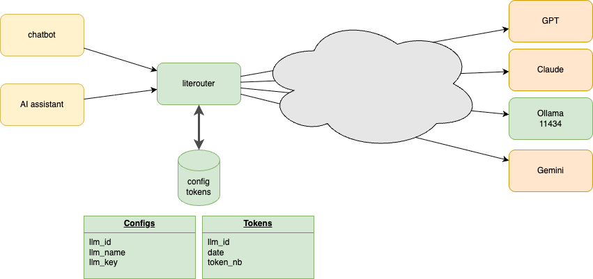
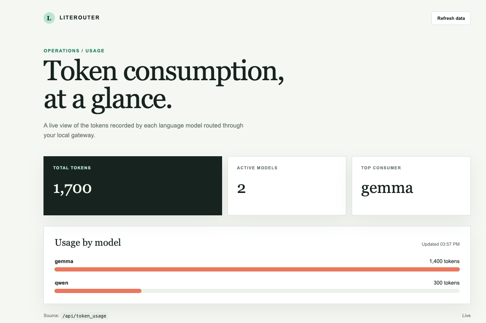

# LiteRouter

> Literouter is a tool to route LLM request from chatbot or AI application to a LLM server like Ollama or Openai.

- [LiteRouter](#literouter)
  - [Quickstart](#quickstart)
  - [Design](#design)
    - [LiteRouter Endpoints](#literouter-endpoints)
  - [Dasboard](#dasboard)
  - [How to use it](#how-to-use-it)


## Quickstart 

```
python3 -m venv .venv
source .venv/bin/activate
pip install -r requirements.txt
pip install --upgrade pip
python main.py
```

## Design



### LiteRouter Endpoints

**POST /api/chat**
> To chat with Ollama

**GET /api/version**
> Ollama version

**GET /api/tags**
> List all models available

**GET /api/token_usage**
> Give token usage by model

## Dasboard

> To view the token consuption



## How to use it

- [Tests with Bruno](./tests/unit_test.md)

