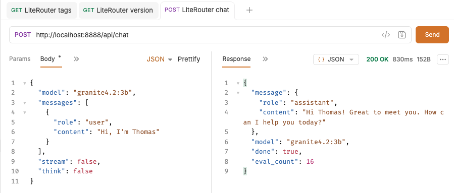
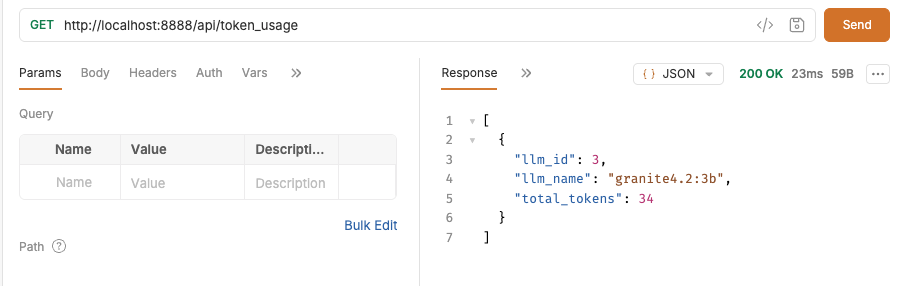

# LLM Router - LiteRouter

- [LLM Router - LiteRouter](#llm-router---literouter)
  - [Chat - /api/chat](#chat---apichat)
  - [Token Usage - /api/token\_usage](#token-usage---apitoken_usage)


## Chat - /api/chat

```sh
curl --request POST \
  --url http://localhost:8888/api/chat \
  --header 'content-type: application/json' \
  --data '{
  "model": "gemma",
  "thinking": true,
  "messages": [
    {
      "role": "assistant",
      "content": "Hello, what can I do?"
    }
  ]
}'
```



## Token Usage - /api/token_usage

```sh
curl --request GET \
  --url http://localhost:8888/api/token_usage \
  --header 'content-type: application/json'
```
  

